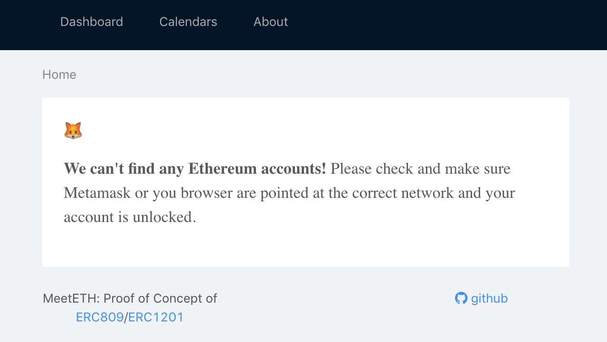
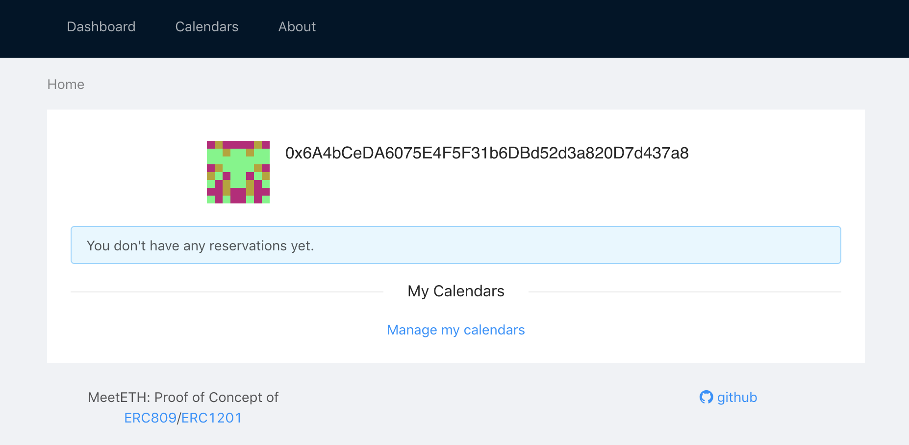
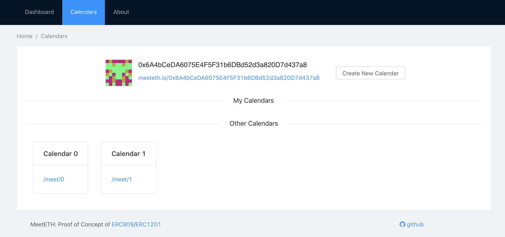
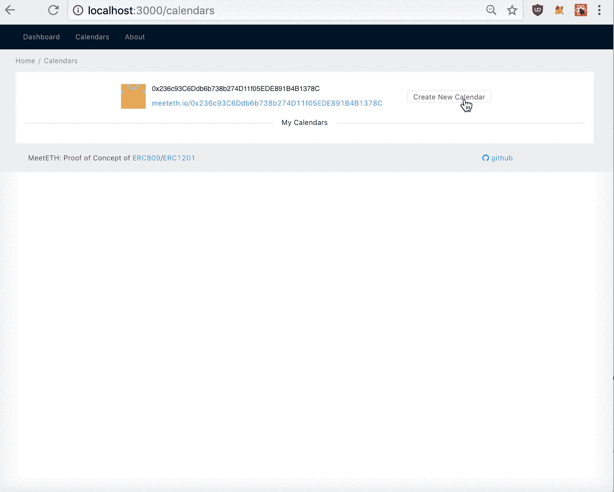
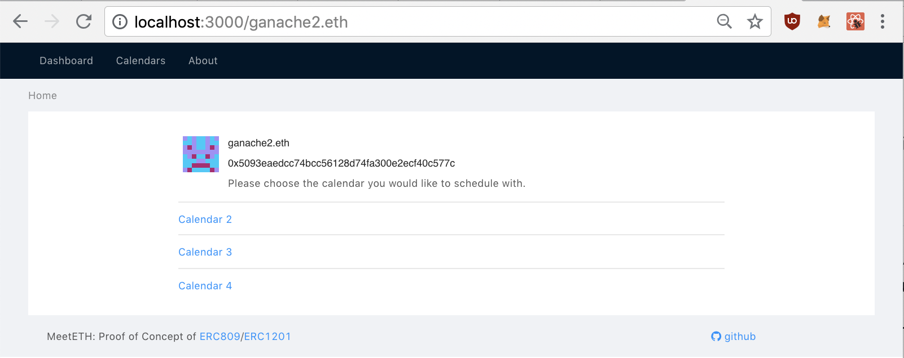
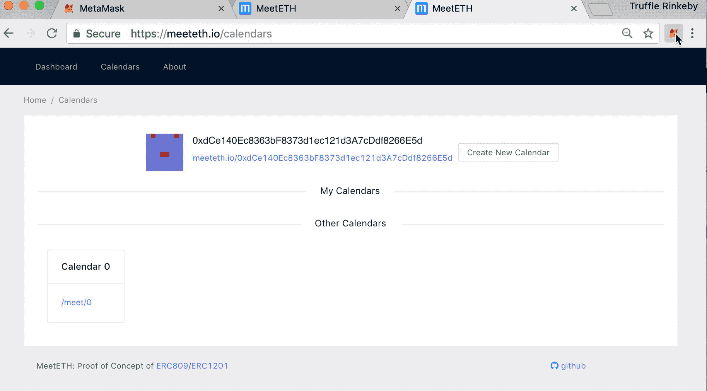

# Consensys Academy 2018 Developer Program Final Project

# Overview

**MeetETH**

Code Repository: https://github.com/saurfang/meeteth

Library Code Repository:https://github.com/saurfang/solidity-treemap

## Description

MeetETH is a scheduling Dapp that allows user to create tokenized calendar bound to an ethereum account and invite other users to create tokenized reservations on such calendars.

This Dapp serves as a proof of concept for [ERC809](https://github.com/ethereum/EIPs/issues/809), the standard for rentable non-fungible tokens, and [ERC1201](https://github.com/ethereum/EIPs/issues/1201), a corresponding two-tiered token approach. Each ERC809/ERC1201 token represents an ephemeral access to a tokenized (non-)fungible asset. Such asset may be a travel accommodation, some professional service e.g. doctor, or even the right of road. Visit the [MeetETH blog series](https://medium.com/@saurfang/erc809-1201-tokenizing-non-fungible-access-abdc5018c49) for more details about why and how we tokenize access.

## User Story

A user who wants to open a calendar for others to reserve may create a calendar. The calendar is minted as a ERC721 token and belongs to the calendar owner. The user can create as many calendar as he wants. She may also list all of her calendars as well as all reservations on any of the calendars.

A user who wants to reserve a spot on the calendar may mint a ERC721 reservation token tied to the specific calendar. The reservation can be freely traded on any exchanges that supports the ERC721 standard. A reservation token can only be minted if the corresponding time frame on the calendar has yet been reserved by someone else.

# Setup

To setup the development environment, you will need `yarn` and `ganache-cli`

```bash
# install npm packages
yarn
# start development networks
# npm install -g ganache-cli
ganache-cli
# compile and deploy contracts
truffle migrate
# start development webserver
yarn start
```

`npm install` and `npm start` should also work but is not officially supported.

# Grading Rubrics

## User Interface Requirements

### Run app on a dev server locally for testing/grading

Follow `Setup` section above to start local dev server.

### Should be able to visit a URL and interact with the app

If you haven't imported accounts and unlock metamask, or you are not on the correct network, you will be greeted with:



Once you unlock the account, proceed to the next sections for available interactions.

### The applications should have the following features:

- Display the current account
- Sign transactions using metamask / uPort
- Reflect updates to to the contract state

**Dashboard**


You will be greeted with your current account, its blockie thumbnail, as well as list of reservation and calendar tokens you own. Initially you don't own either.

Click `Manage my calendars` at the bottom or `Calendars` at the top and navigate to `Manage Calendars` page.

**Manage Calendars**



Along with information about your current account, there is a personalized link which you may share to invite others to reserve on your calendars. Click `Create New Calendar` button to the right, and you will be prompted to sign a transaction which creates your own calendar. Calendars currently **don't** have additional metadata such as Calendar name or scheduling rules etc. Once the block is mined, the calendar should show up under `My Calendars`.

**Note: Due to a bug in the Truffle drizzle framework, the UI might not update upon the first interaction.** When running on development network (ganache), if the calendar does not show up within a few seconds, please create another calendar which should trigger the correct state update. Alternatively, if you refresh the page, the updated state should render as well but your next interaction might still have the UI delay bug.



For more interactions, please refer to [Dapp User Interactions](dapp_interactions.md)

# Test Requirements

- 5 tests (Javascript or Solidity or both)
  with explanations for each smart contract written
  (where appropriate)
- Tests are properly structured
  (ie sets up context, executes a call on
  the function to be tested, and verifies
  the result is correct)
- Tests provide adequate coverage for the contracts
- All tests pass

Both `MeetETH` and library `solidity-treemap` have integrated CI and test coverage, as seen in the README badges:

MeetETH
[](https://travis-ci.org/saurfang/meeteth)
[](https://coveralls.io/github/saurfang/meeteth?branch=master)

solidity-treemap
[](https://travis-ci.org/saurfang/solidity-treemap)
[](https://coveralls.io/github/saurfang/solidity-treemap?branch=master)

Sample test results from `truffle test` are as follows:

MeetETH

```
  Contract: Calendar
    availability
      ✓ maintains ownership of token to actual owner
      ✓ lets renter reserve and gain access (218ms)
      ✓ blocks after reservation (777ms)
      ✓ prevents double book (228ms)
    cancellation
      ✓ makes cancelled time period available again (411ms)
      ✓ reverts if requestor doesn't own the reservation
      ✓ reverts if the calendar id doesn't match
    batch cancellation
      ✓ makes cancelled time period available again (98ms)
      ✓ skips reservations that requestor doesn't own (44ms)
      ✓ does not cancel reservations outside requested time range
    getters
      ✓ return number of reservations for a calendar (43ms)
      ✓ return reservation details for a calendar (47ms)
      ✓ reverts if the calendar request is out of bound
      ✓ return reservation details for a renter (52ms)

  Contract: Reservation
    allows owner to
      ✓ reserve and emits Creation Event (162ms)
      ✓ cancel and emits Cancellation Event (264ms)
    handles token id
      ✓ incrementing the id every time (359ms)
      ✓ not affected by cancellation (293ms)
    does not allow non-owner to
      ✓ reserve
      ✓ cancel (72ms)


  20 passing (9s)
```

solidity-treemap

```
  Contract: MathUtilTest
    ceilLog2
      ✓ throws for 0
      works for
        ✓ 1 (54ms)
        ✓ 2 to 16 (305ms)
        ✓ 2**(4 to 256) +- 1 (10770ms)

  Contract: TreeMapMock
    simple case
      ✓ works for put and get (241ms)
      ✓ works for remove (442ms)
      ✓ works for put and putIfAbsent (619ms)
      ✓ returns the correct tree height (849ms)
    insertions should work with
      ✓ elements in sorted order (744ms)
      ✓ elements in reverse sorted order (869ms)
      ✓ elements in alternating outside-in order (685ms)
[ 3, 0, 7, 2, 1, 4, 6, 5 ]
      ✓ elements in any order (786ms)
    delete should work with
      ✓ elements in sorted order (1434ms)
      ✓ elements in reverse sorted order (2693ms)
      ✓ elements in alternating outside-in order (1549ms)
[ 2, 7, 3, 6, 5, 4, 1, 0 ]
      ✓ elements in any order (1396ms)
    navigable map
      ✓ can find ceiling and floor entries (761ms)
      ✓ can find higher and lower entries (876ms)
      ✓ can find first and last entries (631ms)
    order static map
      ✓ can select entries by index (775ms)
      ✓ can rank entries (793ms)


  21 passing (30s)
```

# Design Pattern Requirements

- Implement a circuit breaker / emergency stop
- What other design patterns have you used or
  not used?

`Calendar.sol` contract [extends](https://github.com/saurfang/meeteth/blob/master/contracts/Calendar.sol#L10) `Pausable` lifecycle contract from [openzeppelin-solidity](https://github.com/OpenZeppelin/openzeppelin-solidity/blob/master/contracts/lifecycle/Pausable.sol).Public functions are marked with `whenNotPaused` modifier to ensure the contract can be paused in the event of bugs.

Because `transfer` and other standard ERC721 are implemented without modifications, they are intentionally not overriden with the `whenNotPaused` modifiers. That means transfer will continue to be possible when the `Calendar` contract is paused.

`Reservation.sol` contract does not need emergency stop because `reserve` and `cancel` are the only non-inherited public functions and they are guarded with `onlyOwner`. Hence, only `Calendar.sol` may operate `Reservation.sol` and a paused `Calendar.sol` would free `Reservation.sol` correspondingly.

Refer to [design pattern and decisions](design_pattern_decisions.md) for more details.

# Security Tools / Common Attacks

Both `MeetETH` and `solidity-treemap` CI integrate [`solium`](https://github.com/duaraghav8/Solium) linting, which performs [security static analysis](https://www.npmjs.com/package/solium-plugin-security#list-of-rules).

Automated security check [Mythril](https://github.com/ConsenSys/mythril) has been performed and found no actionable vulnerabilities. Detailed logs can be found at [mythril.log](mytril.log).

No external contract call is performed other than the trusted `Reservation.sol` contract thus there is no **Reentrancy** vulnerability.

**Integer Overflow** have been mitigated with the use of [`SafeMath`](https://github.com/OpenZeppelin/openzeppelin-solidity/blob/master/contracts/math/SafeMath.sol) library in `Reservation.sol`. The incrementing token id is the only implemented arithmetic operation in the contract.

Only `cancelAll` function in `Calendar.sol` performs array iteration in either contract. However, the length of iteration is controlled by the arguments thus caller may fit their request under block gas limit by limiting the window of cancellation. In addition, we impose a limit on the duration of a reservation to 8 hours because we don't have other spam protection mechanism in place. This serves as a soft speed bump that user will need to send multiple transactions to squat a calendar. This mitigates the **Denial of Service** attack vector.

There is no **timestamp dependency** in the contract. There is no handling of Ether thus **Force Sending Ether** does not cause any problem.

# Use a library

`Calendar.sol` uses `TreeMap.sol` library which we implemented in [`solidity-treemap`](https://github.com/saurfang/solidity-treemap).

`solidity-treemap` is a Solidity library which implements a navigable order static sorted treemap using Red Black Tree.

The treemap enables storage of (uint -> uint) mapping that further provides a total ordering by keys and navigation functions returning closest matches for any given keys.

Such map has a wide range of use cases in smart contracts, for example:

1. Order book matching (by price)
2. Calendar scheduling (by time)
3. TCR reputation ranking (by score)

The map is backed by a Red-Black tree where all lookup operations can be efficiently completed in `O(log n)` time. Due to lack of generics in Solidity, both keys and values take forms in `uint256`. The value class can be easily extended to support any type by mantaining an additional `mapping (uint => myStruct)` at the use site.

# Stretch requirements

## Integrated with Ethereum Name Service

On the **Personal Scheduling Page**, it supports ENS lookup and reverse lookup. For local development, we need to deploy our own ENS registry (incorporated in our `truffle migrate` step) and register our ENS names using the following script:

```bash
truffle exec scripts/ens.js -n ganache2 -a 0x5093eaedcc74bcc56128d74fa300e2ecf40c577c
```



We can replace the URL with ENS name and still get the same schedule UI.

## Testnet Deployment

The addresses provided in [deployed_addresses.md](deployed_addresses.md) correctly point to deployed contracts on the rinkeby testnet.

The interactions can be seen below. Note UI changes can be delayed as block needs time to confirm.



## Project uses IPFS

The website has also been published onto IPFS and can be found at:

You will need to be on Rinkeby network to interact with the contracts.
