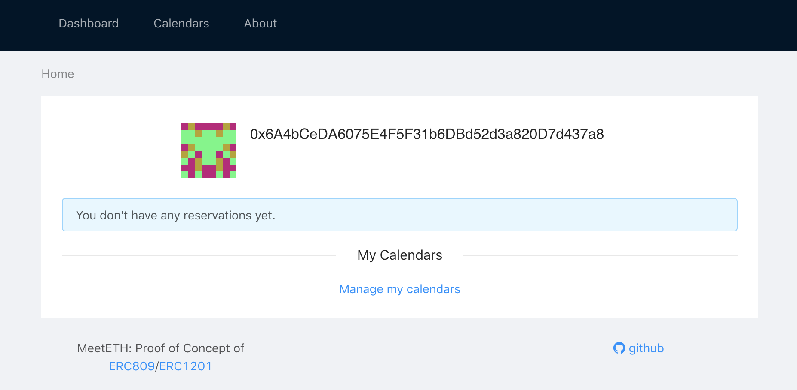
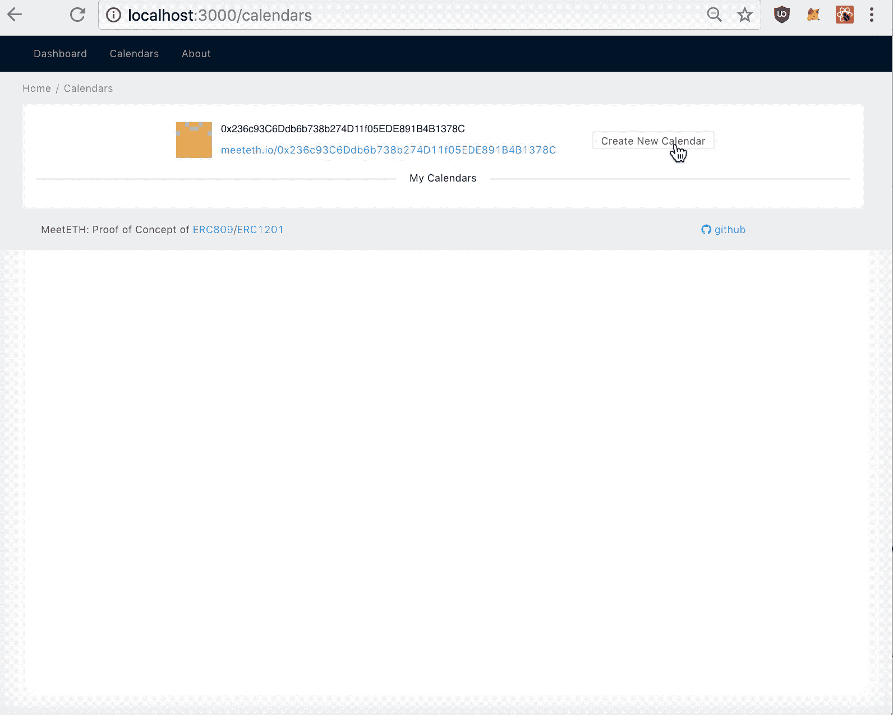
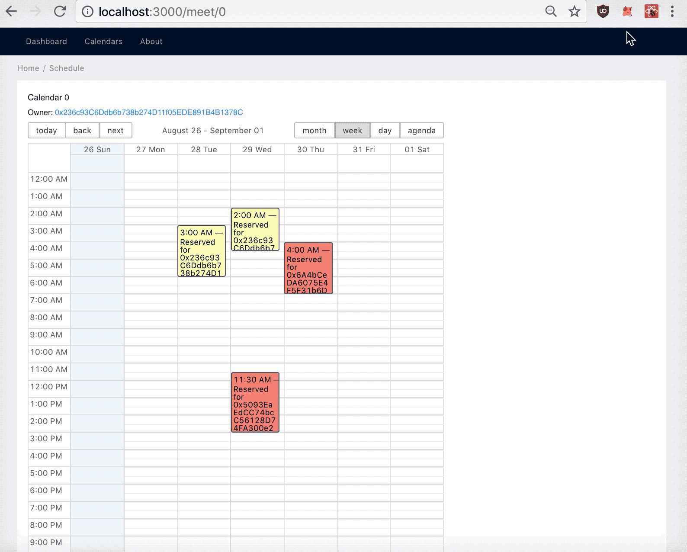
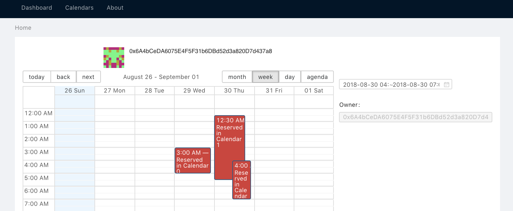
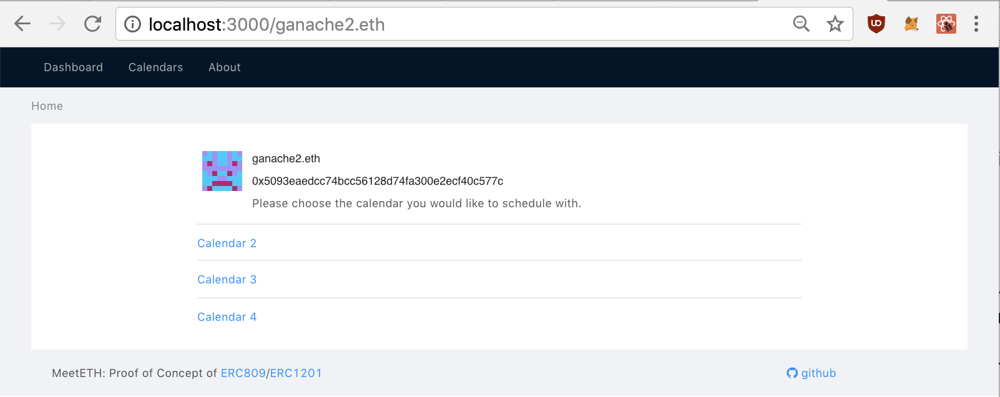

# MeetETH Dapp User Interactions

**Dashboard**


You will be greeted with your current account, its blockie thumbnail, as well as list of reservation and calendar tokens you own. Initially you don't own either.

Click `Manage my calendars` at the bottom or `Calendars` at the top and navigate to `Manage Calendars` page.

**Manage Calendars**


Along with information about your current account, there is a personalized link which you may share to invite others to reserve on your calendars. Click `Create New Calendar` button to the right, and you will be prompted to sign a transaction which creates your own calendar. Calendars currently **don't** have additional metadata such as Calendar name or scheduling rules etc. Once the block is mined, the calendar should show up under `My Calendars`.

**Note: Due to a bug in the Truffle drizzle framework, the UI might not update upon the first interaction.** When running on development network (ganache), if the calendar does not show up within a few seconds, please create another calendar which should trigger the correct state update. Alternatively, if you refresh the page, the updated state should render as well but your next interaction might still have the UI delay bug.



**Schedule Events**

Once a calendar has been created, you can click on one of the `/meet/<id>` link below to navigate to schedule interface. There reservation can be made. Reservations are color coded to the hash of owner's address.


Notice that reservation may not overlap on the same calendar and an overlapping request would result a revert in the smart contract:


Because reservation is a ERC721 token, it can be easily transferred to other account using the `transferFrom/safeTransferFrom` function:



Finally, a reservation can be cancelled by burning the reservation token:


Once a reservation is cancelled, the timeslot frees up again and can be scheduled once more.

**Dashboard**

Now that we have scheduled some events, if we navigate back to dashboard, reservations will show up both in the Calendar view and Agenda view. Notice it is possible to own reservations that overlap in time across calendars.




**Personal Scheduling Page**

Finally, every account owner has its own scheduling page:


Here the user is presented with the entire list of calendars of the account.

Furthermore, this page support ENS lookup and reverse lookup. For local development, we need to deploy our own ENS registry (incorporated in our `truffle migrate` step) and register our ENS names using the following script:

```bash
truffle exec scripts/ens.js -n ganache2 -a 0x5093eaedcc74bcc56128d74fa300e2ecf40c577c
```



We can replace the URL with ENS name and still get the same schedule UI.
